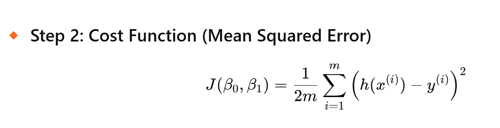
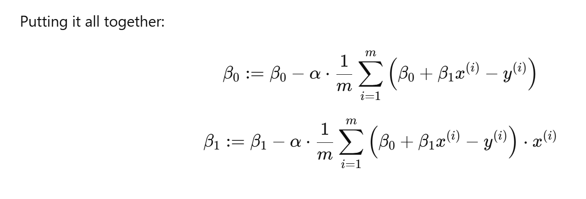
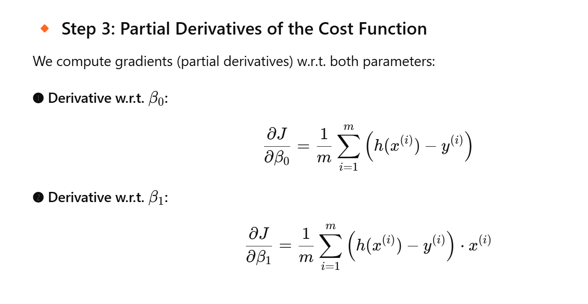

# Linear Regression

Linear regression is a statistical method used to model the relationship between a dependent variable and one or more independent variables. It is one of the simplest and most commonly used techniques in machine learning and data analysis.

## Key Concepts

- **Dependent Variable (Y):** The outcome or target variable that we aim to predict or explain.
- **Independent Variable(s) (X):** The input features or predictors used to model the dependent variable.
- **Linear Relationship:** Linear regression assumes a linear relationship between the dependent and independent variables.

## Equation

The equation for simple linear regression (with one independent variable) is:

```
Y = β₀ + β₁X + ε
```

Where:
- `Y` is the predicted value.
- `β₀` is the intercept (value of Y when X = 0).
- `β₁` is the slope (rate of change of Y with respect to X).
- `X` is the independent variable.
- `ε` is the error term (difference between actual and predicted values).

For multiple linear regression (with multiple independent variables), the equation becomes:

```
Y = β₀ + β₁X₁ + β₂X₂ + ... + βnXn + ε
```

## Applications

- Predicting house prices based on features like size, location, etc.
- Estimating sales based on advertising spend.
- Modeling relationships in scientific research.

## Assumptions

1. Linearity: The relationship between X and Y is linear.
2. Independence: Observations are independent of each other.
3. Homoscedasticity: Constant variance of errors.
4. Normality: Errors are normally distributed.

Linear regression is a foundational technique that serves as a building block for more advanced machine learning models.


## Gradient Descent in Linear Regression

Gradient Descent is an optimization algorithm used to minimize the cost function in linear regression by iteratively updating the model parameters. It helps find the best-fit line by reducing the error between predicted and actual values.

### Cost Function

The cost function for linear regression is the Mean Squared Error (MSE):

```
J(β₀, β₁) = (1/2m) * Σ [h(Xᵢ) - Yᵢ]²
```



Where:
- `m` is the number of training examples.
- `h(Xᵢ)` is the predicted value: `h(Xᵢ) = β₀ + β₁Xᵢ`.
- `Yᵢ` is the actual value.

### Gradient Descent Algorithm

The goal is to minimize `J(β₀, β₁)` by updating the parameters `β₀` and `β₁` iteratively:

1. Initialize `β₀` and `β₁` with random values.
2. Update the parameters using the following equations:

```
β₀ := β₀ - α * (∂J/∂β₀)
β₁ := β₁ - α * (∂J/∂β₁)
```



Where:
- `α` is the learning rate (controls the step size).
- `∂J/∂β₀` and `∂J/∂β₁` are the partial derivatives of the cost function.

### Derivation of Gradients

The partial derivatives of the cost function are:

1. For `β₀`:
```
∂J/∂β₀ = (1/m) * Σ [h(Xᵢ) - Yᵢ]
```

2. For `β₁`:
```
∂J/∂β₁ = (1/m) * Σ [h(Xᵢ) - Yᵢ] * Xᵢ
```



Substitute these gradients into the update rules to iteratively adjust `β₀` and `β₁`.

### Iterative Process

Repeat the updates until the cost function converges (i.e., changes in `J(β₀, β₁)` become negligible). The final values of `β₀` and `β₁` represent the optimal parameters for the linear regression model.

### Visualization

Gradient Descent can be visualized as moving downhill on a surface (cost function) to reach the lowest point (minimum error).


Basic Python implementation:

```python

# Simple gradient descent for linear regression
import numpy as np

# Example data
x = np.array([1, 2, 3, 4, 5])
y = np.array([3, 5, 7, 9, 11])

# Parameters
m = len(x)
b0 = 0
b1 = 0
alpha = 0.01
epochs = 1000

# Gradient Descent Loop
for _ in range(epochs):
    y_pred = b0 + b1 * x
    error = y_pred - y
    b0 -= alpha * (1/m) * np.sum(error)
    b1 -= alpha * (1/m) * np.sum(error * x)

print(f"Intercept: {b0:.2f}, Slope: {b1:.2f}")
```


## Choosing the Learning Rate (α)

The learning rate `α` is a crucial hyperparameter in the Gradient Descent algorithm. It determines the size of the steps taken towards minimizing the cost function. Selecting an appropriate value for `α` is essential for the algorithm's performance.

### Guidelines for Selecting `α`

1. **Start Small**: Begin with a small value, such as `0.01` or `0.001`, and observe the convergence behavior.
2. **Experimentation**: Test different values of `α` to find the one that works best for your dataset.
3. **Avoid Large Values**: A large `α` can cause the algorithm to overshoot the minimum, leading to divergence.
4. **Monitor Convergence**: Plot the cost function over iterations to ensure it decreases steadily.

### Common Practices

- Use a **learning rate schedule** to adjust `α` dynamically during training (e.g., reduce `α` as the number of iterations increases).
- Implement **adaptive optimizers** like Adam or RMSProp, which adjust the learning rate automatically.

### Example of Testing `α`

```python
import numpy as np
import matplotlib.pyplot as plt

# Example data
x = np.array([1, 2, 3, 4, 5])
y = np.array([3, 5, 7, 9, 11])

# Parameters
m = len(x)
b0 = 0
b1 = 0
epochs = 1000

# Test different learning rates
learning_rates = [0.001, 0.01, 0.1]
for alpha in learning_rates:
    b0, b1 = 0, 0
    cost_history = []
    for _ in range(epochs):
        y_pred = b0 + b1 * x
        error = y_pred - y
        cost = (1/(2*m)) * np.sum(error**2)
        cost_history.append(cost)
        b0 -= alpha * (1/m) * np.sum(error)
        b1 -= alpha * (1/m) * np.sum(error * x)
    plt.plot(cost_history, label=f"α={alpha}")

plt.xlabel("Iterations")
plt.ylabel("Cost")
plt.legend()
plt.title("Cost Function vs. Iterations")
plt.show()
```

By visualizing the cost function, you can identify the learning rate that leads to smooth and steady convergence.
